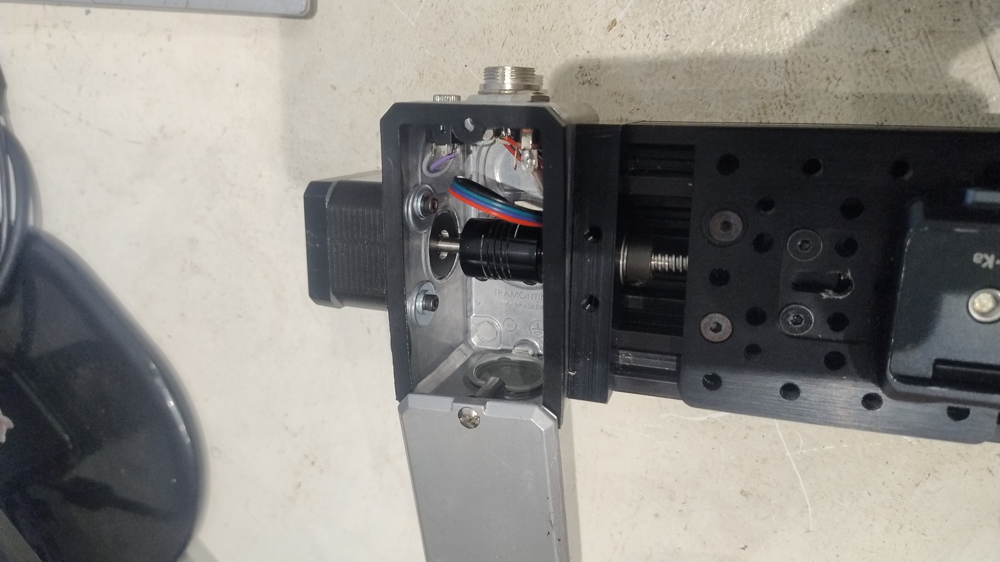
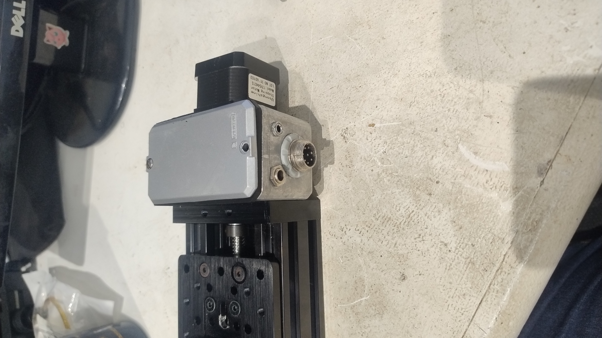
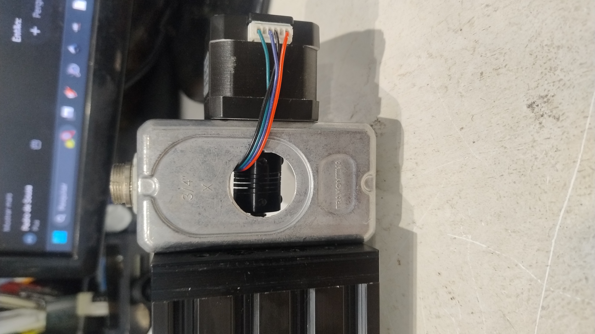
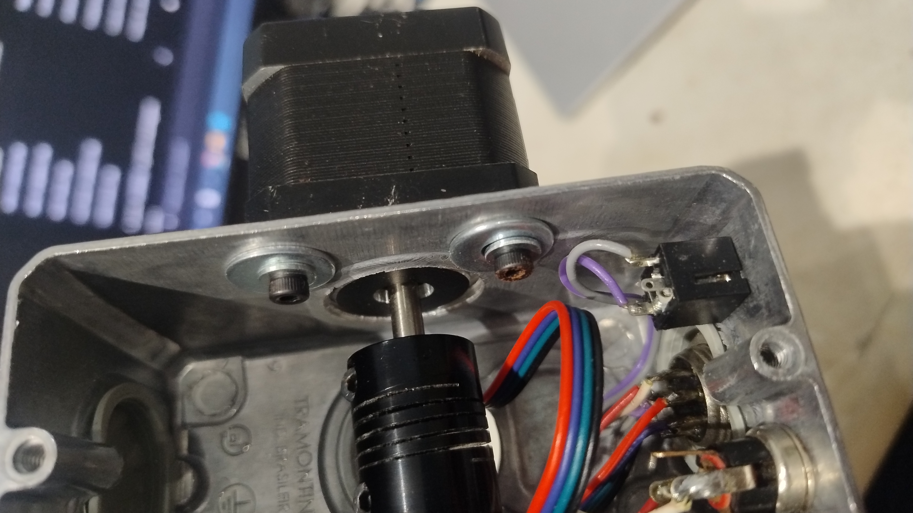
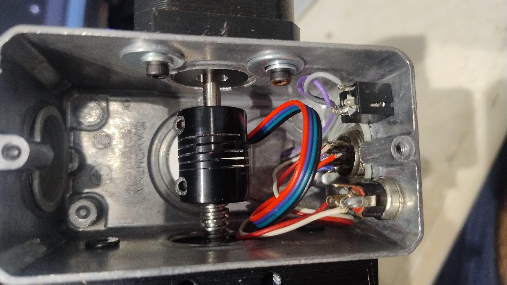
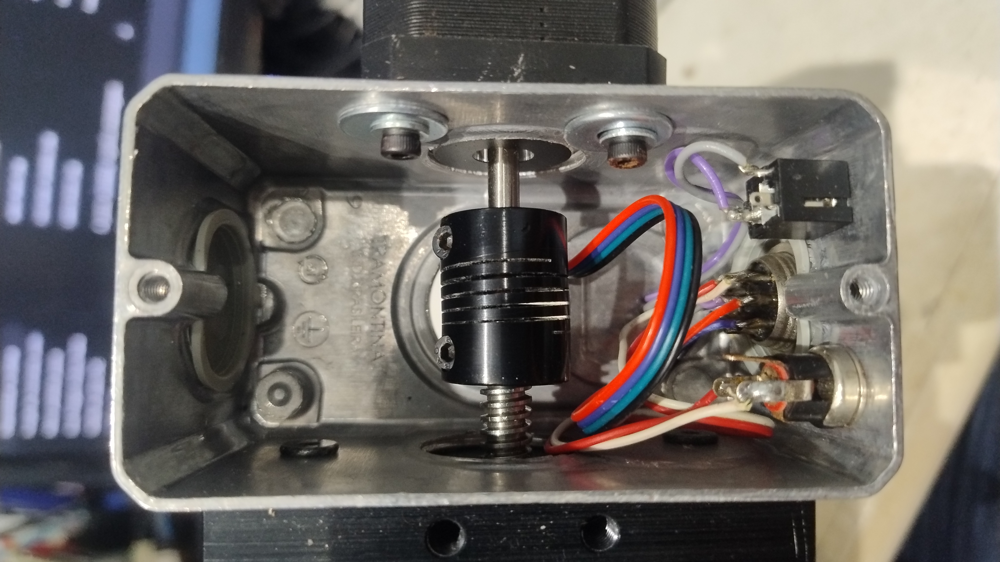
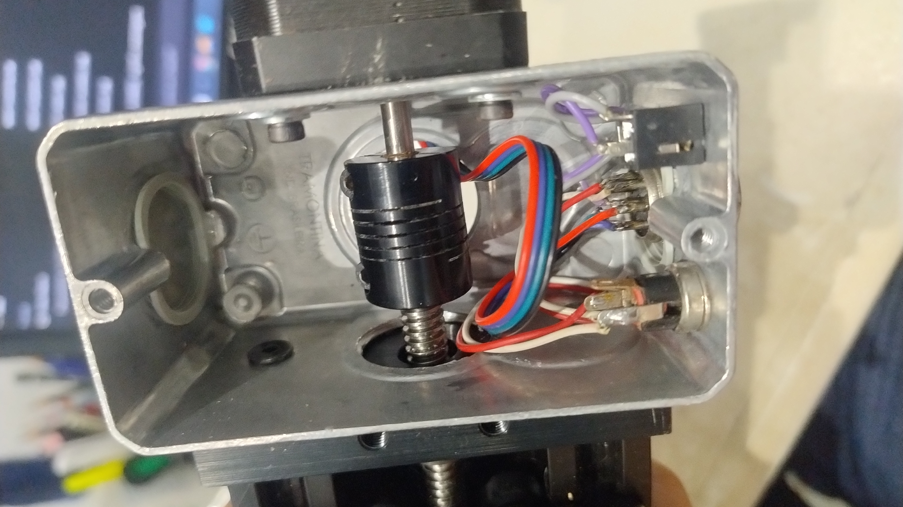
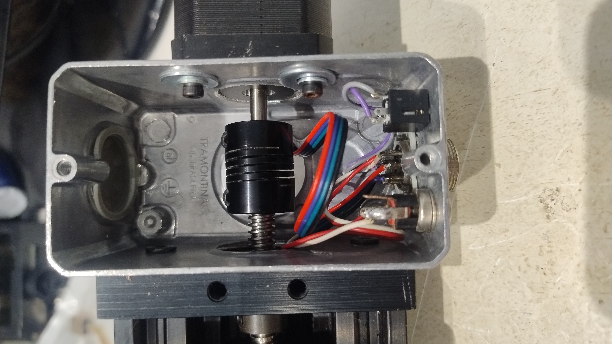
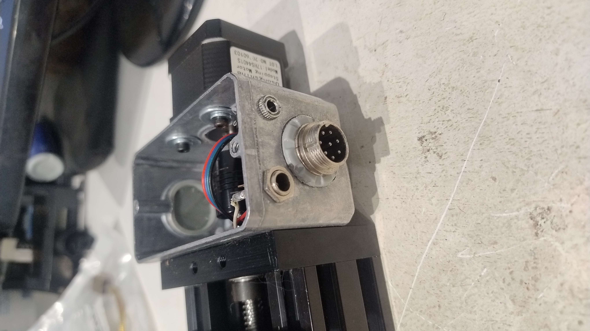
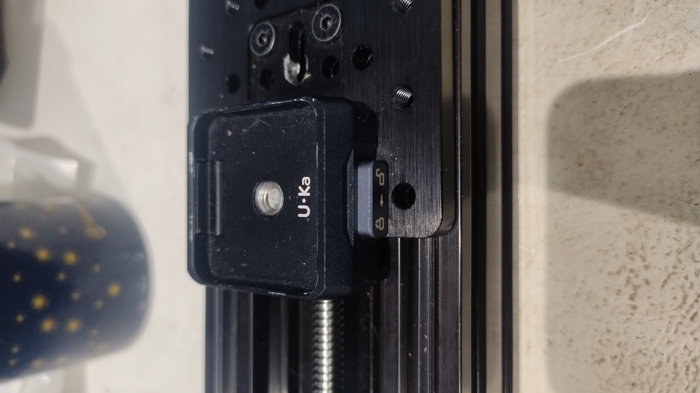

# Mechanical Assembly — Arandu Stack Macro Rail v1.0.0

[Português](#português) | [English](#english)

Este documento descreve a montagem mecânica do **Arandu Stack Macro Rail v1.0.0**.

O sistema utiliza como base um atuador linear C-Beam comercial, modificado e integrado aos demais componentes necessários para sua utilização como trilho motorizado para macrofotografia e focus stacking.

---

# Português

## 1. Visão geral

A estrutura mecânica do **Arandu Stack Macro Rail** é baseada em um conjunto de atuador linear **C-Beam de 250 mm**, equipado com fuso trapezoidal **T8×2**.

O conjunto possui aproximadamente **150 mm de curso útil**.

O movimento é produzido por um motor de passo **NEMA 17** acoplado ao fuso. A câmera é instalada sobre o carro móvel do trilho através de um sistema de liberação rápida.

A montagem utilizada no projeto também inclui uma adaptação construída a partir de uma **caixa elétrica de alumínio 4×2"**, utilizada para a integração mecânica entre o motor e o conjunto do trilho.

*Visão geral do Arandu Stack Macro Rail montado.*

## 2. Principais componentes mecânicos

Os principais componentes utilizados nesta montagem são:

- atuador linear C-Beam de 250 mm;
- fuso trapezoidal T8×2;
- carro móvel do conjunto C-Beam;
- motor de passo NEMA 17;
- acoplador flexível fornecido com o conjunto C-Beam;
- bucha de cobre de aproximadamente 1 mm de espessura;
- caixa elétrica de alumínio 4×2";
- placa de liberação rápida Ulanzi U-KA2;
- parafusos, arruelas e demais elementos de fixação necessários à montagem.

A lista geral de componentes do projeto está disponível em [`../materials.md`](../materials.md).

## 3. Conjunto C-Beam

O atuador C-Beam constitui a estrutura principal do trilho.

A versão utilizada possui comprimento nominal de **250 mm** e aproximadamente **150 mm de deslocamento útil**.

O sistema de transmissão utiliza um fuso trapezoidal **T8×2**, com:

- diâmetro nominal de 8 mm;
- passo de 2 mm;
- avanço de 2 mm por revolução.

O carro móvel se desloca longitudinalmente sobre o perfil C-Beam e constitui a superfície sobre a qual é instalado o sistema de fixação da câmera.

O conjunto C-Beam utilizado é um componente comercial. O projeto Arandu Stack Macro Rail utiliza sua estrutura e mecanismo de deslocamento como base para a implementação do sistema motorizado.

## 4. Montagem e acoplamento do motor

O movimento do trilho é realizado por um motor de passo **NEMA 17**.

Para integrar o motor ao conjunto C-Beam foi utilizada uma **caixa elétrica de alumínio 4×2"**, modificada para funcionar como estrutura de suporte e proteção do sistema de acoplamento.

*Motor NEMA 17 instalado sobre a caixa de alumínio 4×2" utilizada na adaptação mecânica.*

### 4.1 Fixação da caixa ao trilho

A caixa de alumínio foi posicionada sobre a extremidade do C-Beam e centralizada em relação ao eixo do fuso.

Com a caixa posicionada, os pontos correspondentes aos furos de fixação existentes na extremidade do trilho foram marcados diretamente sobre a caixa.

Após a furação, a caixa foi fixada ao conjunto utilizando os **próprios parafusos de fixação do trilho**.

Esse método permite utilizar a própria geometria do conjunto C-Beam como referência para o posicionamento da caixa, sem depender de um gabarito específico de furação.

*Detalhe da montagem da caixa de alumínio na extremidade do conjunto C-Beam.*

### 4.2 Fixação e centralização do motor

O NEMA 17 foi posicionado sobre a face oposta da caixa, com seu eixo aproximadamente alinhado ao eixo do fuso T8×2.

Foi realizada uma abertura com folga ao redor da passagem do eixo do motor. Essa folga permite pequenos ajustes de posição durante a montagem, facilitando a centralização do eixo do motor em relação ao fuso.

*Folga na abertura de montagem utilizada para permitir pequenos ajustes de posicionamento e centralização do motor.*

O motor foi fixado à caixa utilizando parafusos e **arruelas**. As arruelas auxiliam na fixação e permitem o ajuste do conjunto durante o processo de alinhamento.

Antes do aperto definitivo dos parafusos, a posição do motor deve ser ajustada até que seu eixo esteja alinhado ao fuso.

### 4.3 Adaptação do acoplamento

O acoplador flexível fornecido com o conjunto C-Beam foi mantido para transmitir o movimento do motor ao fuso T8×2.

O diâmetro do eixo do motor utilizado não era diretamente compatível com o diâmetro interno do acoplador.

Para compensar essa diferença foi utilizada uma **bucha de cobre de aproximadamente 1 mm de espessura**, instalada entre o eixo do motor e o acoplador.

A sequência de transmissão utilizada no sistema é:

**NEMA 17 → bucha de cobre → acoplador flexível → fuso T8×2**

*Visão interna da caixa mostrando o sistema de acoplamento entre o motor e o fuso.*

*Detalhe do acoplador flexível instalado entre o eixo do motor e o fuso T8×2.*

*Vista interna do conjunto mostrando o acoplamento e parte das conexões elétricas.*

A bucha permite o encaixe adequado do eixo no acoplador e a transmissão do movimento do motor para o fuso.

A necessidade e as dimensões dessa adaptação podem variar caso sejam utilizados motores ou acopladores com dimensões diferentes.

### 4.4 Alinhamento do conjunto

O alinhamento entre o eixo do motor, o acoplador e o fuso é importante para o funcionamento adequado do trilho.

O desalinhamento pode introduzir esforço lateral, vibração, aumento da resistência mecânica e irregularidades durante o deslocamento.

O motor deve ser inicialmente instalado sem o aperto definitivo dos parafusos. A folga existente na abertura da caixa permite pequenos deslocamentos para realizar o alinhamento.

Após a centralização, os parafusos de fixação do motor e do acoplador podem ser apertados.

*Visão geral do conjunto motor, caixa de adaptação e C-Beam após a montagem.*

### 4.5 Conectores do conjunto

A caixa de adaptação também serve como ponto de instalação dos conectores utilizados para a interligação elétrica entre o conjunto do trilho e o módulo de controle.

*Conectores instalados na caixa de adaptação para interligação entre o trilho e o módulo de controle.*

A função e a pinagem desses conectores são descritas separadamente na documentação elétrica do projeto.

## 5. Fixação da câmera

A câmera é instalada sobre o carro móvel do C-Beam utilizando uma placa de liberação rápida **Ulanzi U-KA2**.

*Placa de liberação rápida Ulanzi U-KA2 instalada sobre o carro móvel do trilho.*

A base do sistema de liberação rápida é fixada diretamente sobre a placa do carro do trilho.

O sistema permite instalar e remover a câmera sem desmontar os demais componentes do Macro Rail.

Outros sistemas de fixação podem ser utilizados desde que sejam mecanicamente compatíveis com o carro do trilho e proporcionem fixação adequada e estável para a câmera utilizada.

## 6. Verificação mecânica

Antes de conectar e operar o sistema eletrônico, deve-se verificar manualmente a montagem mecânica.

Verifique:

- fixação da caixa de alumínio ao C-Beam;
- fixação do motor NEMA 17;
- alinhamento entre o eixo do motor e o fuso;
- posicionamento da bucha de cobre;
- fixação do acoplador;
- ausência de deformação lateral excessiva do acoplador;
- rotação livre do fuso;
- movimentação livre do carro;
- ausência de pontos de travamento ao longo do curso;
- fixação do sistema de liberação rápida;
- estabilidade da câmera sobre o carro;
- aperto dos elementos de fixação.

Caso seja percebido aumento de resistência ou irregularidade durante o movimento, o alinhamento do motor deve ser verificado novamente.

Pequenos ajustes podem ser realizados afrouxando a fixação do motor, reposicionando-o dentro da folga disponível na abertura da caixa e realizando novamente o aperto.

## 7. Adaptações do projeto

O atuador C-Beam, o motor de passo, o acoplador, o sistema de liberação rápida e os demais componentes comerciais utilizados não foram desenvolvidos especificamente para o Arandu Stack Macro Rail.

O projeto utiliza esses componentes como base para a construção do sistema.

A integração mecânica realizada para esta versão inclui, entre outras adaptações:

- utilização da caixa elétrica de alumínio 4×2" como suporte do motor e proteção do acoplamento;
- adaptação da caixa aos pontos de fixação existentes no C-Beam;
- abertura com folga para permitir o ajuste de alinhamento do motor;
- utilização de arruelas para auxiliar na montagem e ajuste;
- utilização de uma bucha de cobre para compatibilizar o eixo do motor com o acoplador;
- integração da placa de liberação rápida ao carro do trilho.

Essas adaptações, juntamente com a configuração do conjunto e sua integração ao firmware e sistema eletrônico do **Arandu Stack Macro Rail**, são documentadas neste repositório para facilitar a reprodução, estudo e modificação do equipamento.

---

# English

## 1. Overview

The mechanical structure of the **Arandu Stack Macro Rail** is based on a commercial **250 mm C-Beam linear actuator** equipped with a **T8×2 lead screw**.

The assembly provides approximately **150 mm of usable travel**.

Movement is provided by a **NEMA 17 stepper motor** coupled to the lead screw. The camera is mounted on the moving carriage using a quick-release system.

The project also uses an adapted **4×2" aluminum electrical box** as part of the mechanical integration between the motor and the linear rail assembly.

*Overview of the assembled Arandu Stack Macro Rail.*

## 2. Main Mechanical Components

The main mechanical components used in this assembly are:

- 250 mm C-Beam linear actuator;
- T8×2 lead screw;
- C-Beam moving carriage;
- NEMA 17 stepper motor;
- flexible coupler supplied with the C-Beam assembly;
- approximately 1 mm thick copper bushing;
- 4×2" aluminum electrical box;
- Ulanzi U-KA2 quick-release plate;
- screws, washers, and other mounting hardware required for assembly.

The complete project component list is available in [`../materials.md`](../materials.md).

## 3. C-Beam Assembly

The C-Beam actuator forms the main structure of the rail.

The version used has a nominal length of **250 mm** and approximately **150 mm of usable travel**.

The transmission system uses a **T8×2 trapezoidal lead screw** with:

- 8 mm nominal diameter;
- 2 mm pitch;
- 2 mm linear travel per revolution.

The moving carriage travels longitudinally along the C-Beam profile and provides the mounting surface for the camera attachment system.

The C-Beam assembly used in this project is a commercial component. The Arandu Stack Macro Rail uses its structure and linear motion mechanism as the basis for the motorized system.

## 4. Motor Mounting and Coupling

Rail movement is provided by a **NEMA 17 stepper motor**.

A modified **4×2" aluminum electrical box** is used to mechanically integrate the motor with the C-Beam assembly and protect the coupling system.

*NEMA 17 motor installed on the 4×2" aluminum enclosure used for the mechanical adaptation.*

### 4.1 Attaching the Enclosure to the Rail

The aluminum enclosure was positioned at the end of the C-Beam and centered relative to the lead screw axis.

With the enclosure positioned, the existing mounting holes at the end of the rail were used as references to mark the corresponding drilling locations on the enclosure.

After drilling, the enclosure was attached to the assembly using the **rail's original mounting screws**.

This method uses the C-Beam assembly itself as a positioning reference and does not require a separate drilling template.

*Detail of the aluminum enclosure mounted at the end of the C-Beam assembly.*

### 4.2 Motor Mounting and Alignment

The NEMA 17 was positioned on the opposite face of the enclosure, with its shaft approximately aligned with the T8×2 lead screw axis.

An opening with additional clearance around the motor shaft was made in the enclosure. This clearance allows small positional adjustments during assembly, making it easier to center the motor shaft relative to the lead screw.

*Clearance around the mounting opening allows small positional adjustments for motor alignment.*

The motor was secured to the enclosure using screws and **washers**. The washers assist with mounting and allow adjustment during the alignment process.

Before fully tightening the mounting screws, the motor position should be adjusted until its shaft is aligned with the lead screw.

### 4.3 Coupling Adaptation

The flexible coupler supplied with the C-Beam assembly was retained to transmit motor rotation to the T8×2 lead screw.

The shaft diameter of the motor used in this build was not directly compatible with the internal diameter of the coupler.

To compensate for this difference, an approximately **1 mm thick copper bushing** was installed between the motor shaft and the coupler.

The resulting transmission arrangement is:

**NEMA 17 → copper bushing → flexible coupler → T8×2 lead screw**

*Internal view of the enclosure showing the coupling system between the motor and lead screw.*

*Detail of the flexible coupler installed between the motor shaft and the T8×2 lead screw.*

*Internal view showing the coupling assembly and part of the electrical connections.*

The bushing provides the required fit between the motor shaft and the coupler, allowing the motor to transmit motion to the lead screw.

The need for this adaptation and its dimensions may vary if motors or couplers with different dimensions are used.

### 4.4 Assembly Alignment

Alignment between the motor shaft, coupler, and lead screw is important for proper rail operation.

Misalignment may introduce lateral loads, vibration, increased mechanical resistance, and irregular movement.

The motor should initially be installed without fully tightening its mounting screws. The clearance around the opening in the enclosure allows small positional adjustments for alignment.

Once the assembly is centered, the motor mounting screws and coupler screws can be tightened.

*Overview of the motor, adaptation enclosure, and C-Beam assembly after installation.*

### 4.5 Assembly Connectors

The adaptation enclosure also provides mounting points for the connectors used to electrically connect the rail assembly to the control module.

*Connectors installed on the adaptation enclosure for connection between the rail and control module.*

The function and pinout of these connectors are described separately in the project's electrical documentation.

## 5. Camera Mounting

The camera is attached to the C-Beam moving carriage using an **Ulanzi U-KA2 quick-release plate**.

*Ulanzi U-KA2 quick-release plate installed on the moving rail carriage.*

The quick-release base is mounted directly on the rail carriage plate.

The system allows the camera to be installed and removed without disassembling the other Macro Rail components.

Other camera mounting systems may be used provided that they are mechanically compatible with the rail carriage and provide adequate and stable support for the camera being used.

## 6. Mechanical Inspection

Before connecting and operating the electronic system, the mechanical assembly should be manually inspected.

Check:

- attachment of the aluminum enclosure to the C-Beam;
- NEMA 17 motor mounting;
- alignment between the motor shaft and lead screw;
- copper bushing positioning;
- coupler attachment;
- absence of excessive lateral deformation of the coupler;
- free rotation of the lead screw;
- free movement of the carriage;
- absence of mechanical binding throughout the travel;
- quick-release system mounting;
- camera stability on the carriage;
- mounting hardware tightness.

If increased resistance or irregular movement is detected, the motor alignment should be checked again.

Small adjustments can be made by loosening the motor mounting screws, repositioning the motor within the available clearance in the enclosure opening, and tightening the assembly again.

## 7. Project Adaptations

The C-Beam actuator, stepper motor, coupler, quick-release system, and other commercial components used in the system were not specifically developed for the Arandu Stack Macro Rail.

The project uses these components as the mechanical basis for the system.

Mechanical integration implemented in this version includes, among other adaptations:

- use of a 4×2" aluminum electrical box as the motor support and coupling enclosure;
- adaptation of the enclosure to the existing C-Beam mounting points;
- clearance around the motor shaft opening to allow alignment adjustment;
- use of washers to assist mounting and adjustment;
- use of a copper bushing to match the motor shaft to the coupler;
- integration of the quick-release plate with the rail carriage.

These adaptations, together with the overall system configuration and its integration with the **Arandu Stack Macro Rail** firmware and electronic system, are documented in this repository to facilitate reproduction, study, and modification of the equipment.
