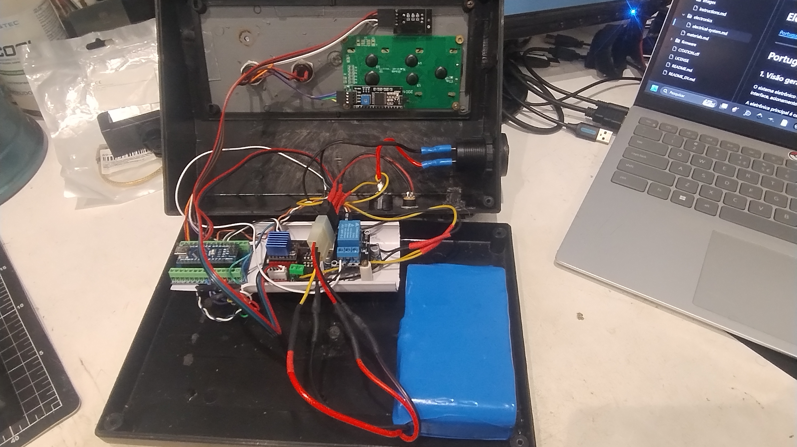
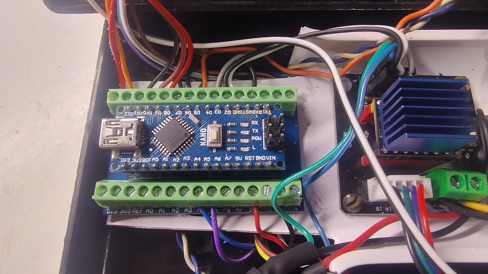
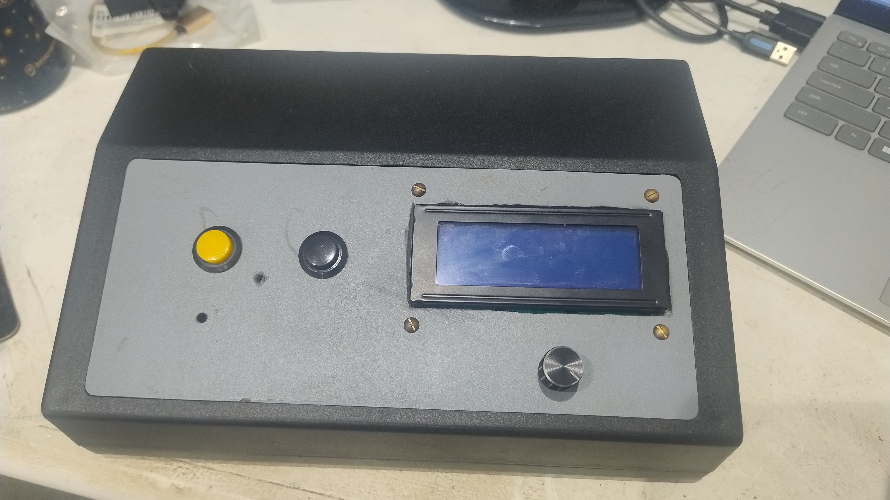
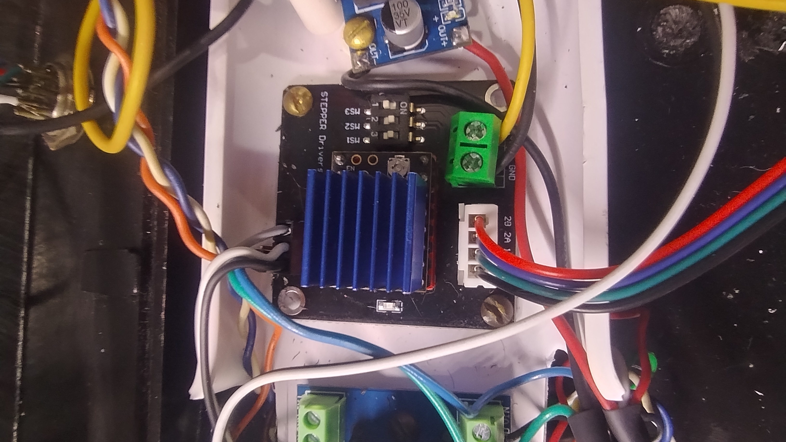
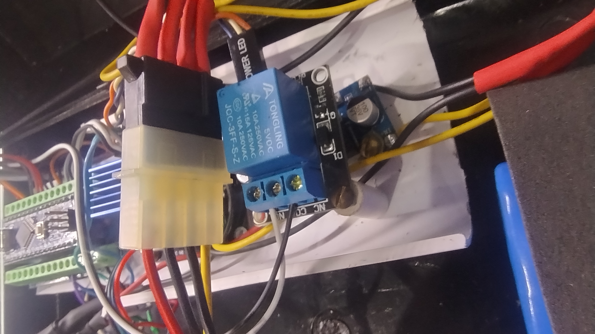
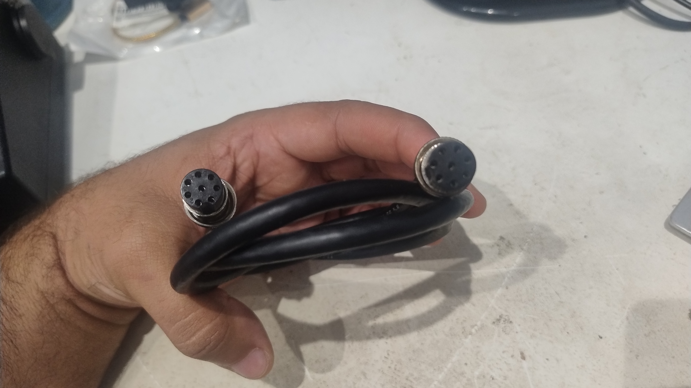
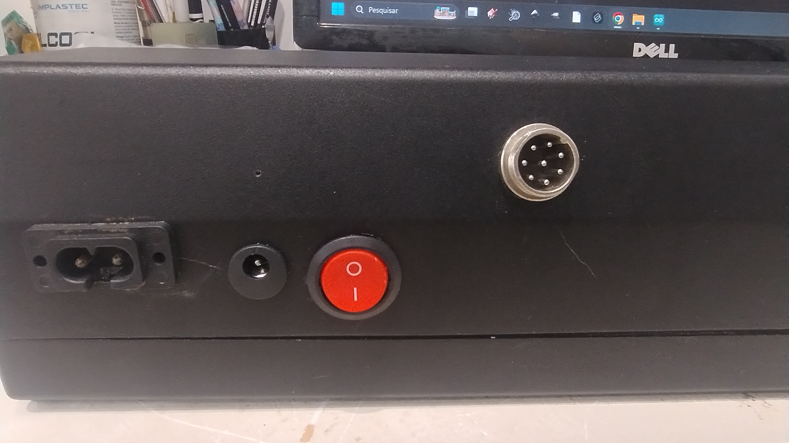
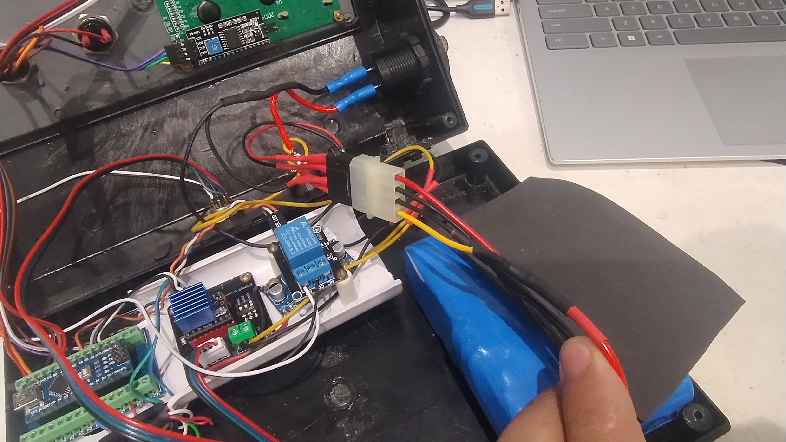

# Eletrônica / Electronics

[Português](#português) | [English](#english)

---

# Português

## 1. Visão geral

O sistema eletrônico do Arandu Stack Macro Rail foi desenvolvido a partir da integração de módulos eletrônicos comerciais de fácil aquisição.

A eletrônica principal é responsável por:

- controle do motor de passo;
- interface com o usuário;
- acionamento do disparo da câmera;
- distribuição de alimentação;
- comunicação entre o módulo de controle e o trilho;
- leitura opcional da tensão da bateria.

O protótipo utiliza um Arduino Nano como unidade principal de controle.

A montagem apresentada corresponde ao protótipo funcional utilizado durante o desenvolvimento do sistema. A disposição física dos módulos, conectores e fiação pode ser modificada em outras implementações sem alterar o princípio de funcionamento.

---

## 2. Unidade de controle

O sistema utiliza um **Arduino Nano** instalado sobre uma placa de expansão com bornes de parafuso.

A placa de expansão facilita a conexão dos diferentes módulos e permite realizar alterações, manutenção e testes sem a necessidade de soldar diretamente nos terminais do Arduino.

O Arduino é responsável pelo processamento da interface, controle do movimento, acionamento do disparo da câmera e execução das rotinas implementadas no firmware.

---

## 3. Interface de controle

A interface do equipamento utiliza:

- display LCD 20×4;
- módulo adaptador I²C para o LCD;
- encoder rotativo KY-040;
- dois botões de comando.

O LCD apresenta os menus, parâmetros e informações de operação do sistema.

O encoder é utilizado para navegação pelos menus e ajuste dos parâmetros, enquanto os botões adicionais executam funções específicas definidas pelo firmware.

A lógica completa de operação da interface é descrita separadamente no manual de uso do equipamento.

---

## 4. Controle do motor de passo

O motor NEMA 17 é controlado por um driver **TMC2209**.

No protótipo, o TMC2209 é instalado em uma **placa de extensão para driver de motor de passo**, utilizada para concentrar e facilitar as conexões entre:

- alimentação;
- motor;
- sinais de controle;
- configuração do driver.

O driver também utiliza um dissipador de calor.

O Arduino envia ao driver os sinais necessários para determinar o deslocamento e o sentido de rotação do motor.

A configuração elétrica do driver deve ser compatível com o motor utilizado. A corrente do driver deve ser ajustada adequadamente antes da operação do sistema.

---

## 5. Disparo da câmera

O disparo da câmera é realizado através de um **módulo relé de 1 canal**.

O Arduino aciona o módulo relé durante a sequência fotográfica. O relé funciona como um contato elétrico isolado para o circuito de disparo da câmera.

Para o disparo são utilizados os terminais:

- **COM — Common / Comum**
- **NO — Normally Open / Normalmente Aberto**

Quando o relé é acionado, os contatos COM e NO são fechados temporariamente, realizando o comando de disparo.

Os dois condutores correspondentes ao disparo seguem pelo cabo principal de 8 vias entre o módulo de controle e o trilho.

No lado do trilho, esses condutores são encaminhados ao cabo de disparo da câmera.

No protótipo, o cabo de disparo utiliza:

- conector P4 no lado do sistema;
- conector P1 no lado da câmera.

O tipo de conector utilizado no lado da câmera pode ser adaptado conforme o equipamento fotográfico utilizado.

---

## 6. Cabo principal de 8 vias

A comunicação elétrica entre o módulo de controle e o trilho é realizada através de um único cabo destacável de **8 vias**.

A distribuição utilizada no protótipo é:

| Pino | Função |
|---:|---|
| 1 | Motor de passo |
| 2 | Motor de passo |
| 3 | Motor de passo |
| 4 | Motor de passo |
| 5 | Disparo da câmera |
| 6 | Disparo da câmera |
| 7 | Alimentação |
| 8 | Alimentação |

Os pinos **1 a 4** correspondem aos quatro condutores do motor de passo.

Os pinos **5 e 6** são utilizados pelo circuito de disparo da câmera.

Os pinos **7 e 8** disponibilizam alimentação proveniente da bateria para a região do trilho.

O sistema utiliza conectores circulares destacáveis de 8 pinos, permitindo separar completamente o módulo de controle do conjunto mecânico durante transporte, manutenção ou armazenamento.

---

## 7. Alimentação

O protótipo utiliza uma bateria **Li-ion 3S4P**.

A bateria possui conexões separadas de entrada e saída, totalizando quatro condutores:

- dois destinados à entrada de alimentação/recarga;
- dois destinados à saída para alimentação do sistema.

### 7.1 Entrada da bateria

O jack P4 instalado no gabinete é conectado diretamente à entrada da bateria.

O caminho de entrada pode ser representado como:

**jack P4 → entrada da bateria**

Essa conexão é utilizada para acesso à entrada de alimentação/recarga do conjunto de bateria.

### 7.2 Saída da bateria

Na saída da bateria:

- o terminal negativo (**GND / OUT−**) segue diretamente para a distribuição de GND do sistema;
- o terminal positivo (**VCC+ / OUT+**) passa pela chave liga/desliga geral antes de seguir para a distribuição positiva.

O caminho principal de alimentação é:

**bateria OUT+ → chave liga/desliga → distribuição VCC+**

**bateria OUT− → distribuição GND**

O gabinete utilizado no protótipo foi reaproveitado de outro equipamento e possui uma entrada IEC remanescente de uma aplicação anterior. **Essa entrada IEC não é utilizada pelo Arandu Stack Macro Rail.**

### 7.3 Tensão

A tensão nominal de um conjunto Li-ion 3S é aproximadamente:

**11,1 V**

A tensão máxima quando completamente carregado é aproximadamente:

**12,6 V**

Os componentes que necessitam de tensões inferiores devem utilizar conversão ou regulação apropriada antes da alimentação.

---

## 8. Alimentação da câmera e acessórios

Duas vias do cabo principal de 8 vias são reservadas para disponibilizar alimentação junto ao trilho.

No protótipo, essa alimentação funciona como um **bypass da saída da bateria**, permitindo utilizar a energia do conjunto para alimentar equipamentos instalados junto ao trilho.

Essa saída pode ser utilizada, por exemplo, para:

- alimentação da câmera;
- iluminação;
- acessórios auxiliares;
- outros módulos compatíveis.

A tensão disponível nessa saída corresponde à tensão do sistema de bateria. Portanto, equipamentos que operem com tensão diferente **não devem ser conectados diretamente**.

Para alimentar uma câmera é necessário utilizar um sistema de conversão adequado à tensão exigida pelo modelo utilizado.

No protótipo com uma **Canon T5i**, é utilizado um conversor compatível com alimentação USB/PD associado a uma dummy battery apropriada para a câmera.

Essa solução é apenas uma implementação possível. Outros modelos de câmera podem exigir tensões, conectores e sistemas de alimentação diferentes.

---

## 9. Leitura da tensão da bateria

O firmware possui suporte funcional para leitura da tensão da bateria através de uma entrada analógica do Arduino.

Essa função pode ser utilizada instalando um **divisor resistivo dimensionado de acordo com a tensão máxima da bateria utilizada**.

A saída do divisor deve fornecer ao pino analógico uma tensão dentro dos limites seguros de entrada do microcontrolador.

O firmware possui uma seção destinada à **calibração da leitura de tensão**, permitindo ajustar o valor apresentado pelo sistema de acordo com a tensão real medida.

Durante o desenvolvimento foram utilizados componentes temporários para testar essa função, incluindo um potenciômetro. Esses componentes de teste **não fazem parte da configuração final do projeto**.

No protótipo atual, a leitura interna de bateria não foi instalada porque é utilizado um voltímetro externo conectado à saída da bateria.

Portanto, o circuito de leitura de bateria deve ser considerado uma **função opcional já suportada pelo firmware**.

---

## 10. Observações sobre a montagem

A montagem eletrônica apresentada nesta documentação corresponde ao protótipo funcional utilizado durante o desenvolvimento do Arandu Stack Macro Rail.

A disposição física dos módulos dentro do gabinete não é obrigatória e pode ser adaptada de acordo com:

- gabinete utilizado;
- disponibilidade dos módulos;
- sistema de alimentação;
- organização da fiação;
- acessórios instalados.

Conectores internos destacáveis, terminais, bornes, emendas e outros elementos auxiliares podem ser utilizados conforme necessário para facilitar montagem e manutenção.

O importante é preservar as conexões elétricas e as funções descritas nesta documentação.

---

# English

## 1. Overview

The Arandu Stack Macro Rail electronic system was developed by integrating commercially available electronic modules.

The main electronics are responsible for:

- stepper motor control;
- user interface;
- camera shutter triggering;
- power distribution;
- communication between the control module and the rail;
- optional battery voltage monitoring.

The prototype uses an Arduino Nano as the main control unit.

The assembly shown corresponds to the functional prototype used during system development. The physical arrangement of modules, connectors and wiring may be modified in other implementations without changing the operating principle.

---

## 2. Control unit

The system uses an **Arduino Nano** installed on an expansion board with screw terminals.

The expansion board simplifies connections between the different modules and allows modifications, maintenance and testing without requiring wires to be soldered directly to the Arduino terminals.

The Arduino is responsible for processing the interface, controlling motion, triggering the camera and executing the routines implemented in the firmware.

---

## 3. Control interface

The equipment interface uses:

- 20×4 LCD;
- I²C adapter module for the LCD;
- KY-040 rotary encoder;
- two control buttons.

The LCD displays menus, parameters and system operating information.

The encoder is used for menu navigation and parameter adjustment, while the additional buttons perform specific functions defined by the firmware.

The complete interface operating logic is described separately in the equipment user guide.

---

## 4. Stepper motor control

The NEMA 17 motor is controlled by a **TMC2209** driver.

In the prototype, the TMC2209 is installed on a **stepper driver extension board**, which is used to organize and simplify connections between:

- power;
- motor;
- control signals;
- driver configuration.

The driver also uses a heat sink.

The Arduino sends the signals required to determine motor movement and rotation direction.

The electrical configuration of the driver must be compatible with the motor being used. Driver current must be properly adjusted before operating the system.

---

## 5. Camera shutter trigger

Camera triggering is performed through a **single-channel relay module**.

The Arduino activates the relay module during the photographic sequence. The relay acts as an isolated electrical contact for the camera shutter circuit.

The following relay terminals are used:

- **COM — Common**
- **NO — Normally Open**

When the relay is activated, the COM and NO contacts are temporarily closed, generating the shutter command.

The two shutter conductors are carried through the main 8-wire cable between the control module and the rail.

On the rail side, these conductors are routed to the camera shutter cable.

In the prototype, the shutter cable uses:

- a P4 connector on the system side;
- a P1 connector on the camera side.

The connector used on the camera side may be adapted according to the photographic equipment being used.

---

## 6. Main 8-wire cable

Electrical communication between the control module and the rail is provided through a single detachable **8-wire cable**.

The pin distribution used in the prototype is:

| Pin | Function |
|---:|---|
| 1 | Stepper motor |
| 2 | Stepper motor |
| 3 | Stepper motor |
| 4 | Stepper motor |
| 5 | Camera shutter |
| 6 | Camera shutter |
| 7 | Power |
| 8 | Power |

Pins **1 through 4** correspond to the four stepper motor conductors.

Pins **5 and 6** are used by the camera shutter circuit.

Pins **7 and 8** provide battery power to the rail area.

The system uses detachable 8-pin circular connectors, allowing the control module to be completely separated from the mechanical rail assembly for transport, maintenance or storage.

---

## 7. Power supply

The prototype uses a **3S4P Li-ion battery pack**.

The battery has separate input and output connections, with a total of four conductors:

- two for power input/charging;
- two for system power output.

### 7.1 Battery input

The P4 jack installed on the enclosure is connected directly to the battery input.

The input path can be represented as:

**P4 jack → battery input**

This connection provides access to the battery pack power/charging input.

### 7.2 Battery output

At the battery output:

- the negative terminal (**GND / OUT−**) is connected directly to the system GND distribution;
- the positive terminal (**VCC+ / OUT+**) passes through the main ON/OFF switch before reaching the positive power distribution.

The main power paths are:

**battery OUT+ → ON/OFF switch → VCC+ distribution**

**battery OUT− → GND distribution**

The enclosure used in the prototype was repurposed from another device and includes an IEC inlet remaining from a previous application. **This IEC inlet is not used by the Arandu Stack Macro Rail.**

### 7.3 Voltage

The nominal voltage of a 3S Li-ion battery pack is approximately:

**11.1 V**

The maximum voltage when fully charged is approximately:

**12.6 V**

Components requiring lower voltages must use appropriate voltage conversion or regulation before being powered.

---

## 8. Camera and accessory power

Two conductors of the main 8-wire cable are reserved for providing power at the rail.

In the prototype, this connection operates as a **bypass from the battery output**, allowing the battery pack to power equipment installed near the rail.

This output may be used, for example, for:

- camera power;
- lighting;
- auxiliary accessories;
- other compatible modules.

The voltage available at this output corresponds to the battery system voltage. Therefore, equipment operating at a different voltage **must not be connected directly**.

To power a camera, an appropriate conversion system must be used to provide the voltage required by the specific camera model.

In the prototype using a **Canon T5i**, a USB/PD-compatible converter is used together with an appropriate dummy battery for the camera.

This is only one possible implementation. Other camera models may require different voltages, connectors and power systems.

---

## 9. Battery voltage monitoring

The firmware includes functional support for battery voltage monitoring through an Arduino analog input.

This function can be used by installing a **resistive voltage divider properly dimensioned for the maximum voltage of the battery being used**.

The divider output must provide the analog input with a voltage within the microcontroller's safe input limits.

The firmware includes a section for **voltage reading calibration**, allowing the displayed value to be adjusted according to the actual measured battery voltage.

During development, temporary components were used to test this function, including a potentiometer. These test components **are not part of the final project configuration**.

In the current prototype, the internal battery monitoring circuit was not installed because an external voltmeter connected to the battery output is used instead.

The battery monitoring circuit should therefore be considered an **optional function already supported by the firmware**.

---

## 10. Assembly notes

The electronic assembly shown in this documentation corresponds to the functional prototype used during development of the Arandu Stack Macro Rail.

The physical arrangement of modules inside the enclosure is not mandatory and may be adapted according to:

- enclosure type;
- module availability;
- power system;
- wiring organization;
- installed accessories.

Internal detachable connectors, terminals, screw terminals, splices and other auxiliary elements may be used as required to simplify assembly and maintenance.

The important requirement is to preserve the electrical connections and functions described in this documentation.
